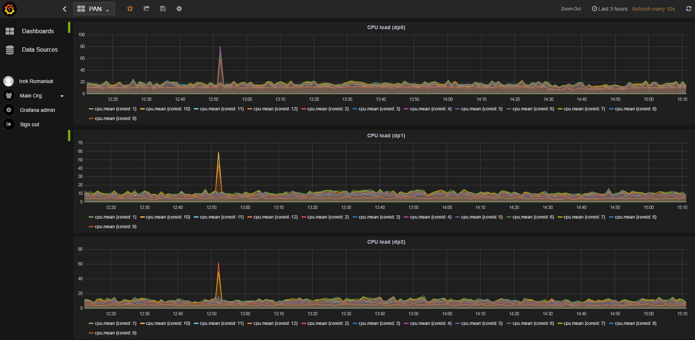

### PaloAlto firewall XML from API to Influx DB 
#### using NodeJS in Docker

Pushing PaloAlto data plane cpu metrics to Influx DB

IP address and key of PAN firewall are in Dockerfile.Influxdb settings are in influx.js

##### Tested on:
1. VM-1000-HV (PAN 7.0.1)
2. 5060 (PAN 7.1)